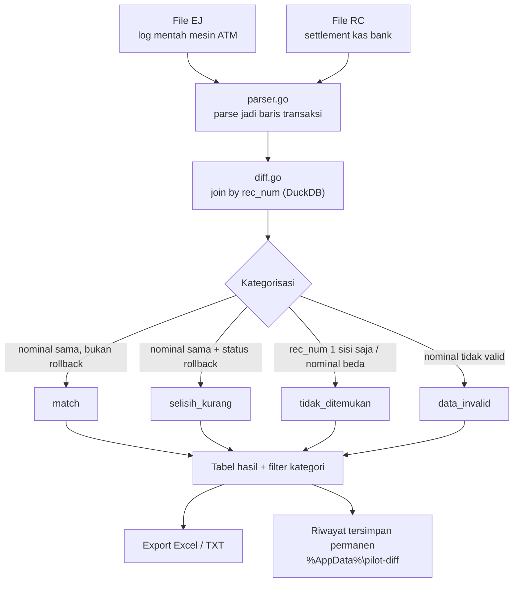
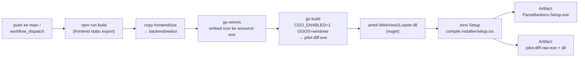

# Parse Bankers

Aplikasi desktop Windows untuk rekonsiliasi harian mesin ATM: mencocokkan
**EJ** (Electronic Journal — log mentah mesin ATM) dengan **RC** (file
settlement kas dari sistem bank), lalu mengelompokkan hasilnya (Match,
Selisih Kurang, Tidak Ditemukan) siap diekspor ke Excel/TXT.

Dipakai internal oleh staf cabang BNI — 1 laptop, 1 user, offline
sepenuhnya, tanpa perlu paham coding sama sekali untuk memakainya.

## Cara kerja



1. User memuat satu file **EJ** dan satu file **RC** lewat UI.
2. Backend mem-parse keduanya jadi baris transaksi (`parser.go`), lalu
   join berdasarkan `rec_num` di DuckDB (`diff.go`).
3. Setiap baris dikategorikan otomatis:

   | Kategori | Kapan terjadi |
   |---|---|
   | `match` | Nominal EJ dan RC sama, transaksi normal (bukan rollback) |
   | `selisih_kurang` | Nominal EJ = RC **dan** status EJ menunjukkan uang ditarik kembali (`ROLLBACK OK`, `ROLLBACK NOTES SUCCESSFULLY`, atau `SHUTTER OPENED FOR NOTES REMOVAL`) — indikasi bank tetap membukukan padahal mesin membatalkan transaksi |
   | `tidak_ditemukan` | Rec num cuma ada di salah satu sisi (EJ atau RC), atau nominal kedua sisi tidak sama — butuh review manual |
   | `data_invalid` | Baris tidak punya nominal yang valid untuk dibandingkan sama sekali |

4. Hasil per kategori bisa difilter, dilihat detailnya, dan diekspor ke
   Excel/TXT. Riwayat setiap run tersimpan permanen di `%AppData%`, bisa
   dibuka lagi setelah aplikasi ditutup.

Aturan kategorisasi di atas hasil dari beberapa putaran koreksi terhadap
data real (lihat `docs/build-from-zero.md` Tahap 7) — bukan asumsi awal.

### Merek mesin ATM yang didukung

Parser sudah divalidasi terhadap format log dari 4 merek, tiap merek
punya kuirk penulisan log yang berbeda (anchor nomor urut, mask kartu,
format Terminal ID) dan ditangani lewat satu parser universal, bukan
percabangan per merek:

- **DN200V** — merek acuan awal, log paling lengkap
- **Hyosung**
- **Hitachi**
- **OKI**

## Tech stack

| Bagian | Teknologi |
|---|---|
| Backend | Go + [Fiber v2](https://gofiber.io/), [DuckDB](https://duckdb.org/) embedded (`go-duckdb`, CGO) buat query rekonsiliasi |
| Frontend | Next.js (static export, client-side murni — tanpa SSR/API routes) |
| Jendela desktop | [WebView2](https://github.com/webview/webview_go) native (bukan Electron/Tauri) — jendela app biasa, bukan tab browser |
| Installer | Inno Setup (wizard Next-Next-Finish, tanpa code-signing) |
| CI/build | GitHub Actions, `windows-latest` runner (satu-satunya tempat exe & installer beneran dirakit) |

## Struktur folder

```
backend/     Go backend (API rekonsiliasi + jendela WebView2 + embed frontend)
frontend/    Next.js UI (static export ke frontend/out, di-embed ke backend/webui)
installer/   Script Inno Setup buat bikin installer Windows
docs/        Roadmap, catatan proses, dan panduan non-teknis
.github/     Workflow CI yang build exe + installer di windows-latest
```

## API backend

Base URL `http://127.0.0.1:8080/api` (loopback only, bukan diakses dari luar):

| Method | Path | Fungsi |
|---|---|---|
| POST | `/jobs` | Bikin job rekonsiliasi baru |
| POST | `/jobs/:id/load/:role` | Upload file EJ atau RC (`role` = `ej`/`rc`) ke job |
| POST | `/jobs/:id/process` | Jalankan proses pencocokan |
| POST | `/jobs/:id/stop` | Batalkan proses yang sedang jalan |
| POST | `/jobs/:id/reset` | Reset job ke state awal |
| GET | `/jobs/:id` | Status job |
| GET | `/jobs/:id/log` | Log proses |
| GET | `/jobs/:id/results` | Ambil baris hasil (bisa difilter `?category=`) |
| GET | `/jobs/:id/export` | Export hasil ke Excel/TXT |
| GET | `/history` | Riwayat run sebelumnya (persisten, baca dari disk) |
| DELETE | `/history` | Hapus semua riwayat |
| GET | `/version` | Versi aplikasi yang sedang jalan |

## Menjalankan secara lokal

Prasyarat: **Go 1.22**, **Node 22** (versi yang sama dipakai CI, lihat
`.github/workflows/build-windows.yml`).

Backend dan frontend jalan sebagai dua proses terpisah saat development:

```bash
# Terminal 1 — backend (API di 127.0.0.1:8080)
cd backend
go run .

# Terminal 2 — frontend (dev server Next.js, hit API backend lewat CORS)
cd frontend
npm install
npm run dev
```

Build native `go run .`/`go build` butuh dependency CGO: `go-duckdb`
(butuh compiler C/C++) dan `webview_go` (butuh GTK3 + WebKitGTK dev
headers di Linux, atau WebView2 Runtime bawaan di Windows 11). Kalau
cuma mau iterasi di logic parser/rekonsiliasi tanpa peduli jendelanya,
cukup jalankan test:

```bash
cd backend
go test ./...
```

Test suite (`parser_test.go`, `diff_test.go`) memakai cuplikan log EJ
asli dari keempat merek ATM di atas sebagai fixture, bukan data sintetis
— jadi regresi kategorisasi (lihat contoh kasus nyata di
`docs/build-from-zero.md`) langsung ketahuan begitu ada yang berubah.

## Build production (exe + installer Windows)

Proses build "asli" **selalu** lewat CI, bukan build manual di laptop
developer — ini juga cara satu-satunya release ini pernah dirakit
(lihat `docs/build-from-zero.md`). Setiap push ke `main`, GitHub
Actions (`.github/workflows/build-windows.yml`) di runner
`windows-latest`:



1. `npm run build` frontend (static export) → di-copy ke `backend/webui`
2. Embed icon resmi ke resource exe (`go-winres`)
3. `go build` backend dengan `CGO_ENABLED=1 GOOS=windows` → `pilot-diff.exe`
4. Ambil `WebView2Loader.dll` (di-load runtime, bukan static link)
5. Compile installer (`installer/setup.iss`) via Inno Setup → `ParseBankers-Setup.exe`

Artifact `ParseBankers-Setup` (installer) dan `pilot-diff-raw-exe` (exe +
dll mentah, buat debug) bisa diunduh dari halaman run Actions repo ini,
atau trigger manual lewat `workflow_dispatch`.

## Dokumentasi lengkap

- [`docs/roadmap.md`](docs/roadmap.md) — keputusan arsitektur & roadmap fase sebelum porting ke desktop
- [`docs/build-from-zero.md`](docs/build-from-zero.md) — narasi teknis, dibangun dari git log asli, tahap demi tahap dari commit pertama sampai sekarang
- [`docs/panduan-membangun-parse-bankers.md`](docs/panduan-membangun-parse-bankers.md) — panduan lengkap (requirement, desain, cara pakai)
- [`docs/panduan-versi-mudah.md`](docs/panduan-versi-mudah.md) — versi ringkas dari panduan di atas
- [`docs/panduan-vibecoding-bangun-dari-nol.md`](docs/panduan-vibecoding-bangun-dari-nol.md) — cerita proses "vibecoding" (prompt-demi-prompt) membangun app ini dari nol
